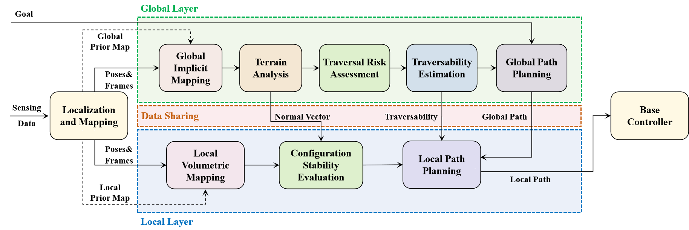

# ReTAP: terrain-aware navigation for a mobile robot
## This code is designed for autonomous navigation of mobile robot on terrain. The main algorithm has been published on IEEE Transactions on Robotics

**Paper Information**: Yuxiang Li, Kun Chen, Yifei Wang, Weifan Zhang, Jiancheng Wang, Haoyao Chen, Yunhui Liu, Real-Time Multi-Level Terrain-Aware Path Planning for Ground Mobile Robots in Large-Scale Rough Terrains, IEEE Transactions on Robotics, 2025. 

---

## Framework Overview




## Prerequisites

- **OS**: Ubuntu 18.04 / 20.04
- **ROS**: Melodic / Noetic
- **Compiler**: GCC 7+ with C++14 support

### Dependencies

```bash
# System libraries
sudo apt install libompl-dev libpcl-dev libopencv-dev \
  libusb-dev binutils-dev
```

---

## Build

### 1. Build QuickHull

```bash
cd src/path_planning/lib/qhull/build
cmake ..
make -j
```

### 2. Build Workspace

```bash
cd /path/to/modules-mapping-me
catkin_make -DBACKWARD_HAS_BFD=0
source devel/setup.bash
```

---

## Quick Start

```bash
# 1. Ensure that the lidar_topic, odom_topic, and other relevant parameters are ready in mapping_module/config & mapping_module/launch.

# 2. Launch mapping module
roslaunch mapping_module mr1000_mapping.launch

# 3. Launch global planning
roslaunch path_planning global_planning_exp.launch

# 4. Launch local planning with Hybrid A*
roslaunch path_planning local_planning_hybrid_astar_exp.launch
```

## Citation

If you use this work in your research, please cite:

```bibtex
@article{li2025realtime,
  title={Real-Time Multi-Level Terrain-Aware Path Planning for 
         Ground Mobile Robots in Large-Scale Rough Terrains},
  author={Li, Yuxiang and Chen, Kun and Wang, Yifei and Zhang, Weifan 
          and Wang, Jiancheng and Chen, Haoyao and Liu, Yunhui},
  journal={IEEE Transactions on Robotics},
  year={2025},
}
```


